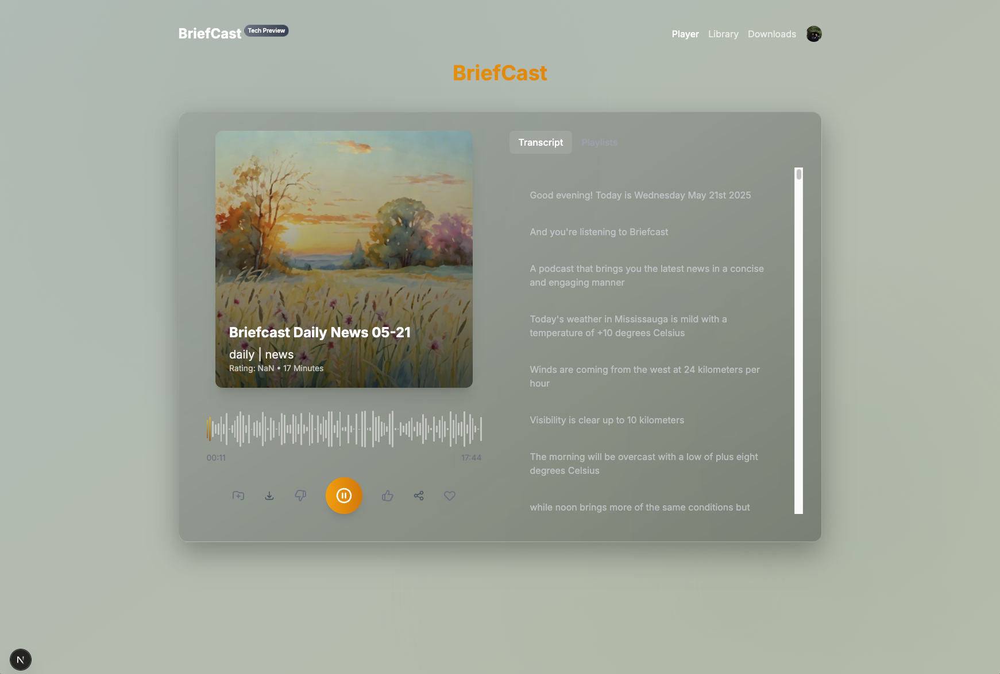

# Briefcast

<div align="center">
  
</div>

> ⚠️ **WARNING: This is a learning and research project**
> 
> This project is intended for personal learning and research only. It is not designed for production use. The code may contain experimental features, unoptimized components, and potential security vulnerabilities. Use at your own risk.

Briefcast is an AI-powered news aggregation and podcast generation platform that transforms news articles into engaging audio content. The platform fetches news from various sources, processes the content using AI, and generates personalized podcasts for users.

## Architecture Overview

This project is designed with scalability and distributed processing in mind. The system is decomposed into several independent modules that can be scaled horizontally:

- **Database Service**: MongoDB for data persistence
- **Message Queue**: RabbitMQ for inter-service communication
- **RSS Fetcher**: Handles feed aggregation and initial processing
- **News Crawler**: Processes and analyzes news content
- **GenAI Workers**: Handles AI model inference and content generation
- **API Server**: Provides REST API endpoints
- **Web Frontend**: User interface built with Next.js

## Technical Overview

Briefcast's backend is built with a modern, scalable architecture that combines multiple technologies to deliver personalized news podcast content. The system is designed for high performance, real-time processing, and intelligent content delivery.

### System Architecture

The system follows a microservices-inspired architecture with the following main components:

1. **Content Ingestion**
   - RSS feed aggregation
   - Content extraction and processing
   - Real-time updates

2. **Content Generation**
   - AI-powered text analysis
   - Audio generation
   - Image processing

3. **User Management**
   - Authentication and authorization
   - Preference tracking
   - History management

4. **Recommendation Engine**
   - Real-time preference learning
   - Multi-stage recommendation process
   - Content personalization

For detailed implementation information, see [IMPLEMENTATION.md](IMPLEMENTATION.md).

### Hardware Requirements

The project is optimized for running on CUDA-enabled devices with substantial computational resources:

- **GPU**: NVIDIA GPU with CUDA support (recommended: RTX 3080 or better)
- **VRAM**: Minimum 16GB
- **RAM**: Minimum 32GB

These requirements are necessary due to the heavy use of AI models for:
- Content analysis and summarization
- Text-to-speech generation
- Image processing
- Vector embeddings generation

## Features

### News Aggregation
- RSS feed integration
- Google News support
- Real-time news updates
- Content categorization
- Hot trending detection

### Content Processing
- AI-powered content analysis
- Automatic summarization
- Keyword extraction
- Language detection
- Content categorization

### Podcast Generation
- Text-to-speech conversion
- Background music integration
- Dynamic audio mixing
- Multiple voice options
- Customizable audio settings

### User Experience
- Personalized content recommendations
- User preference learning
- History tracking
- Category-based browsing
- Responsive web interface

## Webiste Demo

<div align="center">
   
</div>

## Live Demo

This is a personalized daily briefing generated based on my preferences, including the audio narration, cover image, and synchronized lyrics. The content is automatically updated each day with the latest news and weather information.


<div align="center">
  <div style="max-width: 600px; margin: 20px auto; background: #f5f5f5; padding: 20px; border-radius: 10px; box-shadow: 0 2px 10px rgba(0,0,0,0.1);">
    <div style="display: flex; gap: 20px; align-items: stretch;">
      <div style="width: 50%; display: flex; flex-direction: column;">
        <div style="position: relative; width: 100%; aspect-ratio: 1; margin-bottom: 15px;">
          
          <div style="position: absolute; bottom: 0; left: 0; right: 0; padding: 10px; border-bottom-left-radius: 5px; border-bottom-right-radius: 5px;">
            <h3 style="margin: 0; color: white; font-size: 16px; text-align: left;">Briefcast Sample</h3>
            <p style="margin: 0; color: rgba(255, 255, 255, 0.8); font-size: 14px; text-align: left;">News Podcast</p>
          </div>
        </div>
        <audio controls style="width: 100%;">
          <source src="files/sample.mp3" type="audio/mpeg">
          Your browser does not support the audio element.
        </audio>
      </div>
      <div style="width: 50%; height: 100%; max-height: 350px; overflow-y: auto; padding: 10px; background: white; border-radius: 5px; font-size: 14px; line-height: 1.6; display: flex; flex-direction: column; justify-content: flex-start;">
         <p style="margin: 0; padding: 5px 0; color: #666;">Good evening! Today is Wednesday May 21st 2025</p>
         <p style="margin: 0; padding: 5px 0; color: #666;">And you're listening to Briefcast</p>
         <p style="margin: 0; padding: 5px 0; color: #666;">A podcast that brings you the latest news in a concise and engaging manner</p>
         <p style="margin: 0; padding: 5px 0; color: #666;">Today's weather in Mississauga is mild with a temperature of +10 degrees Celsius</p>
         <p style="margin: 0; padding: 5px 0; color: #666;">Winds are coming from the west at 24 kilometers per hour</p>
         <p style="margin: 0; padding: 5px 0; color: #666;">Visibility is clear up to 10 kilometers</p>
         <p style="margin: 0; padding: 5px 0; color: #666;">The morning will be overcast with a low of plus eight degrees Celsius</p>
         <p style="margin: 0; padding: 5px 0; color: #666;">while noon brings more of the same conditions but warmer temperatures with a high of nine degrees Celsius</p>
         <p style="margin: 0; padding: 5px 0; color: #666;">The evening will see continued cloud cover and a light rain with a temperature ranging from ten to six degrees Celsius</p>
         <p style="margin: 0; padding: 5px 0; color: #666;">Looking ahead to tonight</p>
         <p style="margin: 0; padding: 5px 0; color: #666;">we can expect overcast skies again with a slightly cooler temperature</p>
         <p style="margin: 0; padding: 5px 0; color: #666;">from nine to five degrees Celsius</p>
         <p style="margin: 0; padding: 5px 0; color: #666;">Now, let's move into today's news</p>
         <p style="margin: 0; padding: 5px 0; color: #666;">The world of entertainment - where the drama is always real</p>
         <p style="margin: 0; padding: 5px 0; color: #666;">and the glamour can be over the top</p>
         <p style="margin: 0; padding: 5px 0; color: #666;">But beneath all the glitz and excitement lies a fascinating landscape that's constantly shaping popular culture</p>
         <p style="margin: 0; padding: 5px 0; color: #666;">Why should you care about AP Entertainment Wire? It's not just about who's dating whom or who won an award for what</p>
         <p style="margin: 0; padding: 5px 0; color: #666;">Behind every breaking news story</p>
         <p style="margin: 0; padding: 5px 0; color: #666;">there's often a deeper narrative about art</p>
         <p style="margin: 0; padding: 5px 0; color: #666;">society</p>
         <p style="margin: 0; padding: 5px 0; color: #666;">and human nature itself</p>
         <p style="margin: 0; padding: 5px 0; color: #666;">Let me propose this</p>
         <p style="margin: 0; padding: 5px 0; color: #666;">the entertainment industry is like a kaleidoscope reflecting our world's values and anxieties</p>
         <p style="margin: 0; padding: 5px 0; color: #666;">Think of it as a mirror held up to our collective psyche - revealing beauty</p>
         <p style="margin: 0; padding: 5px 0; color: #666;">excess</p>
         <p style="margin: 0; padding: 5px 0; color: #666;">inspiration</p>
         <p style="margin: 0; padding: 5px 0; color: #666;">or chaos</p>
         <p style="margin: 0; padding: 5px 0; color: #666;">depending on what we're seeing</p>
         <p style="margin: 0; padding: 5px 0; color: #666;">To get a better picture of how our screens shape us</p>
         <p style="margin: 0; padding: 5px 0; color: #666;">let's take a closer look at several trends</p>
         <p style="margin: 0; padding: 5px 0; color: #666;">The recent explosion in streaming services has led to an unprecedented surge in original content</p>
         <p style="margin: 0; padding: 5px 0; color: #666;">While there are many good reasons for this trend - such as the democratization of storytelling and more choices for consumers - there's also an inherent problem</p>
         <p style="margin: 0; padding: 5px 0; color: #666;">oversaturation</p>
         <p style="margin: 0; padding: 5px 0; color: #666;">Are audiences tired from constantly having new shows pushed onto them</p>
         <p style="margin: 0; padding: 5px 0; color: #666;">or are we simply adapting to ever-increasing options?  Beyond platforms like Netflix and YouTube</p>
         <p style="margin: 0; padding: 5px 0; color: #666;">another significant player in shaping our popular culture is social media</p>
         <p style="margin: 0; padding: 5px 0; color: #666;">The way influencers market themselves</p>
         <p style="margin: 0; padding: 5px 0; color: #666;">as well as their actual influence on consumers' purchasing habits</p>
         <p style="margin: 0; padding: 5px 0; color: #666;">raises interesting questions about agency</p>
         <p style="margin: 0; padding: 5px 0; color: #666;">authenticity</p>
         <p style="margin: 0; padding: 5px 0; color: #666;">and the limits of digital power</p>
         <p style="margin: 0; padding: 5px 0; color: #666;">Some may view these changes just as part of a never-ending cycle - new technologies replacing old ones</p>
         <p style="margin: 0; padding: 5px 0; color: #666;">different forms of entertainment replacing others</p>
         <p style="margin: 0; padding: 5px 0; color: #666;">Yet what's really changing is how our perceptions of art are shifting; whether it be movies</p>
         <p style="margin: 0; padding: 5px 0; color: #666;">television series or music shows</p>
         <p style="margin: 0; padding: 5px 0; color: #666;">media now more than ever has become integral parts of societal discussions</p>
         <p style="margin: 0; padding: 5px 0; color: #666;">For instance</p>
         <p style="margin: 0; padding: 5px 0; color: #666;">have you heard about the latest phenomenon called Nostalgic Entertainment? Classic movies and TV shows from old decades like 80's or early 90's are receiving revival in terms of their popularity</p>
         <p style="margin: 0; padding: 5px 0; color: #666;">It seems like the older era of television that we once lost connection with is gaining new love and has now started taking over social media platforms in massive ways</p>
         <p style="margin: 0; padding: 5px 0; color: #666;">It's clear entertainment shapes not only our leisure time but also how we think about identity</p>
         <p style="margin: 0; padding: 5px 0; color: #666;">taste</p>
         <p style="margin: 0; padding: 5px 0; color: #666;">community - essential aspects of living our lives</p>
         <p style="margin: 0; padding: 5px 0; color: #666;">You care about AP Entertainment Wire for a reason - whether it's Hollywood's next big blockbuster</p>
         <p style="margin: 0; padding: 5px 0; color: #666;">the world of music where an artist can become a phenomenon almost instantly or trends that change rapidly on social media</p>
         <p style="margin: 0; padding: 5px 0; color: #666;">The world of entertainment is often misunderstood as being solely focused on glamour and excitement</p>
         <p style="margin: 0; padding: 5px 0; color: #666;">but beneath the surface lies a complex landscape that shapes popular culture</p>
         <p style="margin: 0; padding: 5px 0; color: #666;">We've just explored how classic movies and TV shows from decades past are experiencing a revitalized popularity with the rise of Nostalgic Entertainment</p>
         <p style="margin: 0; padding: 5px 0; color: #666;">but what about when iconic franchises try to adapt and evolve for modern audiences</p>
         <p style="margin: 0; padding: 5px 0; color: #666;">Let's dive into the world of entertainment with today's hot topics</p>
         <p style="margin: 0; padding: 5px 0; color: #666;">You know</p>
         <p style="margin: 0; padding: 5px 0; color: #666;">people often ask me</p>
         <p style="margin: 0; padding: 5px 0; color: #666;">"What's the secret to making it big in Hollywood?" My answer is always the same - adaptability</p>
         <p style="margin: 0; padding: 5px 0; color: #666;">With the rise of streaming services</p>
         <p style="margin: 0; padding: 5px 0; color: #666;">the way we consume content has changed dramatically over the past decade</p>
         <p style="margin: 0; padding: 5px 0; color: #666;">Today</p>
         <p style="margin: 0; padding: 5px 0; color: #666;">I want to highlight one key difference between traditional TV and online platforms</p>
         <p style="margin: 0; padding: 5px 0; color: #666;">On Monday nights</p>
         <p style="margin: 0; padding: 5px 0; color: #666;">we witnessed the return of a beloved '80s franchise on NBC's revamped "Magnum P.I." What struck me was how this new iteration not only updated its setting but also its tone</p>
         <p style="margin: 0; padding: 5px 0; color: #666;">Gone are the days when prime-time family viewing relied solely on network TV</p>
         <p style="margin: 0; padding: 5px 0; color: #666;">With Disney+</p>
         <p style="margin: 0; padding: 5px 0; color: #666;">Hulu</p>
         <p style="margin: 0; padding: 5px 0; color: #666;">and Netflix offering a vast array of content</p>
         <p style="margin: 0; padding: 5px 0; color: #666;">audiences now have endless choices</p>
         <p style="margin: 0; padding: 5px 0; color: #666;">Here are some key takeaways from Monday's entertainment landscape</p>
         <p style="margin: 0; padding: 5px 0; color: #666;">* TV's role in society has undergone a significant shift</p>
         <p style="margin: 0; padding: 5px 0; color: #666;">with online services</p>
         <p style="margin: 0; padding: 5px 0; color: #666;">people no longer rely exclusively on traditional networks for their daily dose of entertainment</p>
         <p style="margin: 0; padding: 5px 0; color: #666;">Shows like "Magnum P.I." are trying to navigate this evolving space by offering revamped storylines</p>
         <p style="margin: 0; padding: 5px 0; color: #666;">* The industry's recognition of changing audience preferences is evident in its creative decisions</p>
         <p style="margin: 0; padding: 5px 0; color: #666;">writers and directors are acknowledging that viewers want fresh spins on classic tales</p>
         <p style="margin: 0; padding: 5px 0; color: #666;">* Streaming services' emphasis on niche content appeals to specific interests</p>
         <p style="margin: 0; padding: 5px 0; color: #666;">rather than relying solely on broad-appeal shows like sitcoms</p>
         <p style="margin: 0; padding: 5px 0; color: #666;">platforms cater to individual interests with targeted series</p>
         <p style="margin: 0; padding: 5px 0; color: #666;">Let's talk about why all this matters</p>
         <p style="margin: 0; padding: 5px 0; color: #666;">As our world becomes increasingly digital</p>
         <p style="margin: 0; padding: 5px 0; color: #666;">the media we consume has a direct impact on both culture and society as a whole</p>
         <p style="margin: 0; padding: 5px 0; color: #666;">It's fascinating (and sometimes unsettling) to think about how these streaming services influence what stories get told and what values they prioritize</p>
         <p style="margin: 0; padding: 5px 0; color: #666;">Here are my final thoughts</p>
         <p style="margin: 0; padding: 5px 0; color: #666;">the adaptation of iconic shows like "Magnum P.I" is proof that change - even if uncomfortable at first - can spark creativity within our entertainment landscape</p>
         <p style="margin: 0; padding: 5px 0; color: #666;">The next question for us</p>
         <p style="margin: 0; padding: 5px 0; color: #666;">will we choose diversity in content over tried-and-true formulas</p>
         <p style="margin: 0; padding: 5px 0; color: #666;">paving new ways for authentic stories to bloom</p>
         <p style="margin: 0; padding: 5px 0; color: #666;">The first script discusses the evolution of traditional TV and online platforms</p>
         <p style="margin: 0; padding: 5px 0; color: #666;">while the second script explores why entertainment news matters today</p>
         <p style="margin: 0; padding: 5px 0; color: #666;">The adaptation of iconic shows like "Magnum P.I" is proof that change - even if uncomfortable at first - can spark creativity within our entertainment landscape</p>
         <p style="margin: 0; padding: 5px 0; color: #666;">This willingness to reinvent classic tales aligns with a broader shift in how we consume entertainment</p>
         <p style="margin: 0; padding: 5px 0; color: #666;">where streaming services cater to individual interests and showcase niche content</p>
         <p style="margin: 0; padding: 5px 0; color: #666;">This emphasis on targeting specific audiences resonates deeply with the changing media habits of modern fans</p>
         <p style="margin: 0; padding: 5px 0; color: #666;">Today's pop culture enthusiasts expect to be transported to new worlds</p>
         <p style="margin: 0; padding: 5px 0; color: #666;">either through original storytelling or innovative reimaginings of beloved franchises</p>
         <p style="margin: 0; padding: 5px 0; color: #666;">It looks like we've got some fans of the arts among us</p>
         <p style="margin: 0; padding: 5px 0; color: #666;">eh? "Entertainment" - that's a pretty broad term</p>
         <p style="margin: 0; padding: 5px 0; color: #666;">isn't it? It can mean anything from Hollywood blockbusters to Broadway shows</p>
         <p style="margin: 0; padding: 5px 0; color: #666;">or even just what's trending on your social media feeds</p>
         <p style="margin: 0; padding: 5px 0; color: #666;">But let's be real for a second</p>
         <p style="margin: 0; padding: 5px 0; color: #666;">Why do we care about entertainment in the first place? We consume it because it gives us escapism - an opportunity to temporarily forget our problems and be transported to another world</p>
         <p style="margin: 0; padding: 5px 0; color: #666;">Or maybe it's because we can use pop culture as a way to connect with others</p>
         <p style="margin: 0; padding: 5px 0; color: #666;">whether that means bonding over shared guilty pleasures or dissecting the latest Oscar nominees</p>
         <p style="margin: 0; padding: 5px 0; color: #666;">Speaking of which</p>
         <p style="margin: 0; padding: 5px 0; color: #666;">have you noticed how entertainment is changing in this day and age? With the rise of streaming services like Netflix and HBO Max</p>
         <p style="margin: 0; padding: 5px 0; color: #666;">traditional TV models are starting to crumble</p>
         <p style="margin: 0; padding: 5px 0; color: #666;">Suddenly</p>
         <p style="margin: 0; padding: 5px 0; color: #666;">it's not just about what's on primetime anymore - now</p>
         <p style="margin: 0; padding: 5px 0; color: #666;">your favorite shows can live or die based on how they perform on platforms that don't even air schedules</p>
         <p style="margin: 0; padding: 5px 0; color: #666;">But here's the thing</p>
         <p style="margin: 0; padding: 5px 0; color: #666;">despite all these changes</p>
         <p style="margin: 0; padding: 5px 0; color: #666;">one thing remains constant - our love for the stories themselves</p>
         <p style="margin: 0; padding: 5px 0; color: #666;">Whether you're a die-hard fan of superhero flicks</p>
         <p style="margin: 0; padding: 5px 0; color: #666;">obsessed with true crime documentaries</p>
         <p style="margin: 0; padding: 5px 0; color: #666;">or binging through historical dramas like "The Crown</p>
         <p style="margin: 0; padding: 5px 0; color: #666;">" what drives us to keep coming back?  And that's exactly why entertainment news matters today more than ever</p>
         <p style="margin: 0; padding: 5px 0; color: #666;">We want to know what happens next in our favorite storylines - from the box office hits that capture our imaginations to behind-the-scenes scoops on the personalities behind them</p>
         <p style="margin: 0; padding: 5px 0; color: #666;">Now</p>
         <p style="margin: 0; padding: 5px 0; color: #666;">I'm curious</p>
         <p style="margin: 0; padding: 5px 0; color: #666;">how do you consume your entertainment news? Do you get it through daily newsletters like this one</p>
         <p style="margin: 0; padding: 5px 0; color: #666;">stay up-to-date with online blogs and podcasts</p>
         <p style="margin: 0; padding: 5px 0; color: #666;">or simply scroll through social media feeds for sneak peeks and updates?  And speaking of updates - what's the most surprising pop culture moment that has happened to you in recent memory? Share a personal story about how an entertainment buzz hit you out of nowhere</p>
         <p style="margin: 0; padding: 5px 0; color: #666;">The transition should highlight a logical link between the topics and maintain a professional tone</p>
         <p style="margin: 0; padding: 5px 0; color: #666;">A concise sentence or short series of sentences should be crafted to seamlessly guide the listener from one subject matter into the next</p>
         <p style="margin: 0; padding: 5px 0; color: #666;">Entertainment news at your fingertips! You want the latest scoop on movies</p>
         <p style="margin: 0; padding: 5px 0; color: #666;">music</p>
         <p style="margin: 0; padding: 5px 0; color: #666;">TV</p>
         <p style="margin: 0; padding: 5px 0; color: #666;">or celebrities delivered straight to your inbox? Well</p>
         <p style="margin: 0; padding: 5px 0; color: #666;">we've got just the thing for you!  As it turns out</p>
         <p style="margin: 0; padding: 5px 0; color: #666;">staying current with the world of entertainment can be a full-time job</p>
         <p style="margin: 0; padding: 5px 0; color: #666;">But what if I told you there's a way to get all the highlights without sacrificing your sanity? With AP's personalized newsletter</p>
         <p style="margin: 0; padding: 5px 0; color: #666;">you can have a curated selection of top stories delivered right to your inbox – twice a week</p>
         <p style="margin: 0; padding: 5px 0; color: #666;">But before we dive into the nitty-gritty of subscriptions and email newsletters</p>
         <p style="margin: 0; padding: 5px 0; color: #666;">let's talk about why this matters</p>
         <p style="margin: 0; padding: 5px 0; color: #666;">Why should you care about staying up-to-date on entertainment news? For one</p>
         <p style="margin: 0; padding: 5px 0; color: #666;">it's a great way to stay connected with what's popular in culture</p>
         <p style="margin: 0; padding: 5px 0; color: #666;">Think about it</p>
         <p style="margin: 0; padding: 5px 0; color: #666;">from memes to movies to social justice movements – pop culture is an ever-shifting landscape that can be a fun and engaging reflection of our collective society</p>
         <p style="margin: 0; padding: 5px 0; color: #666;">With AP's newsletter</p>
         <p style="margin: 0; padding: 5px 0; color: #666;">you'll get insider insights and analysis on everything from awards shows like the Oscars and Grammys to box office hits like Avengers and Star Wars</p>
         <p style="margin: 0; padding: 5px 0; color: #666;">Plus</p>
         <p style="margin: 0; padding: 5px 0; color: #666;">you never know when you might stumble upon your next favorite artist or hidden gem release – it could be right in your inbox!  So what are you waiting for? Let's dive into how we can take the guesswork out of keeping current with entertainment news</p>
         <p style="margin: 0; padding: 5px 0; color: #666;">You've probably seen the headlines</p>
         <p style="margin: 0; padding: 5px 0; color: #666;">"Taylor Swift breaks another record" or "The latest superhero mashup hits theaters." But have you ever stopped to think about what's behind those stories? Why do certain celebrities become megastars</p>
         <p style="margin: 0; padding: 5px 0; color: #666;">while others fade into obscurity?  Let's dive in and explore some secrets from the entertainment world</p>
         <p style="margin: 0; padding: 5px 0; color: #666;">You might be surprised at how much psychology and sociology go into making a star</p>
         <p style="margin: 0; padding: 5px 0; color: #666;">First off</p>
         <p style="margin: 0; padding: 5px 0; color: #666;">did you know that the most successful movies of all time are often based on real-life events? This isn't just a coincidence; Hollywood loves tapping into people's desire for escapism</p>
         <p style="margin: 0; padding: 5px 0; color: #666;">Think "The Shawshank Redemption" or "12 Years a Slave." These films aren't just entertaining – they're also cathartic</p>
         <p style="margin: 0; padding: 5px 0; color: #666;">Let's take it one step further</p>
         <p style="margin: 0; padding: 5px 0; color: #666;">What is it about a movie or TV show that makes us emotional? Sometimes</p>
         <p style="margin: 0; padding: 5px 0; color: #666;">it's a universally relatable experience; other times</p>
         <p style="margin: 0; padding: 5px 0; color: #666;">it's the way the filmmaker humanizes characters we might otherwise identify with in real life</p>
         <p style="margin: 0; padding: 5px 0; color: #666;">Take "The Hunger Games" or "Game of Thrones</p>
         <p style="margin: 0; padding: 5px 0; color: #666;">" for example – both are wildly successful because of their ability to tap into our deeper emotions</p>
         <p style="margin: 0; padding: 5px 0; color: #666;">But what does this tell us about our culture? Why do movies like "Titanic" or "Star Wars</p>
         <p style="margin: 0; padding: 5px 0; color: #666;">The Force Awakens" become instant blockbusters?  It's all about how well a story resonates with audiences on multiple levels</p>
         <p style="margin: 0; padding: 5px 0; color: #666;">The key factors include an identifiable protagonist</p>
         <p style="margin: 0; padding: 5px 0; color: #666;">a clear narrative structure</p>
         <p style="margin: 0; padding: 5px 0; color: #666;">and emotional resonance that transcends generations</p>
         <p style="margin: 0; padding: 5px 0; color: #666;">And what happens to those who are cast aside by the entertainment industry? Think Tom Cruise or Harrison Ford – two stars whose careers were once at epic highs are now working much less frequently</p>
         <p style="margin: 0; padding: 5px 0; color: #666;">Why?  There's another element we might talk about</p>
         <p style="margin: 0; padding: 5px 0; color: #666;">the role of celebrity power in pushing change or challenging norms within society</p>
         <p style="margin: 0; padding: 5px 0; color: #666;">be it through donating millions to underprivileged schools</p>
         <p style="margin: 0; padding: 5px 0; color: #666;">using platform to promote LGBTQ+ causes</p>
         <p style="margin: 0; padding: 5px 0; color: #666;">social justice</p>
         <p style="margin: 0; padding: 5px 0; color: #666;">Celebrities have been major game-changers often being one-step ahead of their time and creating trends by setting examples on how to contribute positively</p>
         <p style="margin: 0; padding: 5px 0; color: #666;">Lastly</p>
         <p style="margin: 0; padding: 5px 0; color: #666;">who determines what gets made into a movie or TV show in the first place? It is</p>
         <p style="margin: 0; padding: 5px 0; color: #666;">indeed</p>
         <p style="margin: 0; padding: 5px 0; color: #666;">the studios but perhaps increasingly so with more diverse voices calling for better representation of minorities and different types of stories as well a huge factor is consumer feedback as you've probably noticed on some popular streaming sites where users can vote up or down based on new content proposals</p>
         <p style="margin: 0; padding: 5px 0; color: #666;">This industry's secrets get buried behind a glamorous façade that obscures the complexities underpinning every blockbuster or award-winning series</p>
         <p style="margin: 0; padding: 5px 0; color: #666;">That facade</p>
         <p style="margin: 0; padding: 5px 0; color: #666;">though – it gets broken down piece by piece</p>
         <p style="margin: 0; padding: 5px 0; color: #666;">once we scratch beneath its surface</p>
         <p style="margin: 0; padding: 5px 0; color: #666;">What do you think about all this</p>
         <p style="margin: 0; padding: 5px 0; color: #666;">That wraps up today's episode</p>
         <p style="margin: 0; padding: 5px 0; color: #666;">Thank you for listening</p>
         <p style="margin: 0; padding: 5px 0; color: #666;">We wish you have a great day</p>
         <p style="margin: 0; padding: 5px 0; color: #666;">And we'll see you tomorrow</p>
      </div>
    </div>
  </div>
</div>

## Installation

1. Clone the repository:
```bash
git clone https://github.com/zezhuyu/briefcast.git
cd briefcast
```

2. Install frontend dependencies:
```bash
cd web
npm install
```

3. Install backend dependencies:
```bash
cd backend
apt install -y build-essential libpq-dev portaudio19-dev python3-dev ffmpeg software-properties-common
pip install -r requirements.txt
python -m spacy download en_core_web_sm
playwright install
crawl4ai-setup
```

4. Set up environment variables:

Frontend (`.env`):
```env
# Clerk Authentication
NEXT_PUBLIC_CLERK_PUBLISHABLE_KEY=your_publishable_key
CLERK_SECRET_KEY=your_secret_key
NEXT_PUBLIC_CLERK_SIGN_IN_URL=/sign-in
NEXT_PUBLIC_CLERK_SIGN_UP_URL=/sign-up
NEXT_PUBLIC_CLERK_AFTER_SIGN_IN_URL=/
NEXT_PUBLIC_CLERK_AFTER_SIGN_UP_URL=/

```

To get your Clerk keys:
1. Go to [Clerk Dashboard](https://dashboard.clerk.dev/)
2. Create a new application or select an existing one
3. Go to API Keys in the sidebar
4. Copy the "Publishable Key" and "Secret Key"
5. Paste them into your `.env` file

Backend (`.env`):

## Running the Project

1. Start Database and message queue services:
```bash
cd backend
docker compose up -d
```

2. Start services:
```bash
# Terminal 1 - DB INIT and watch for db events
cd backend
python init_db

# Terminal 2 - News Crawler
cd backend
python aggregator/news_crawler

# Terminal 3 - RSS Fetcher
cd backend
python crawler.py

# Terminal 4 - GenAI workers
cd backend
python async_generator.py

# Terminal 5 - Main API Server
cd backend
python app.py
```

4. Start the frontend development server:
```bash
cd web
npm run dev
```
The application will be available at:
- Frontend: http://localhost:3000
- Backend API: http://localhost:5001

## Development

### Frontend Development
- Uses Next.js 14 with App Router
- Implements responsive design with Tailwind CSS
- State management with Zustand
- API integration with React Query

### Backend Development
- Asynchronous processing with RabbitMQ
- Batch processing for news feeds
- AI-powered content analysis
- Audio generation and processing

## API Documentation

The API documentation is available at `API.md` when running the backend server. It includes:
- Authentication endpoints
- News feed endpoints
- Podcast generation endpoints
- User preference endpoints

## License

MIT

